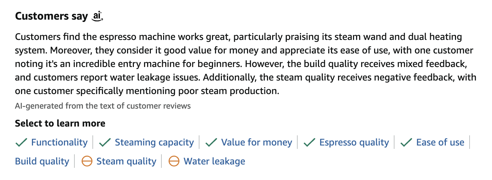
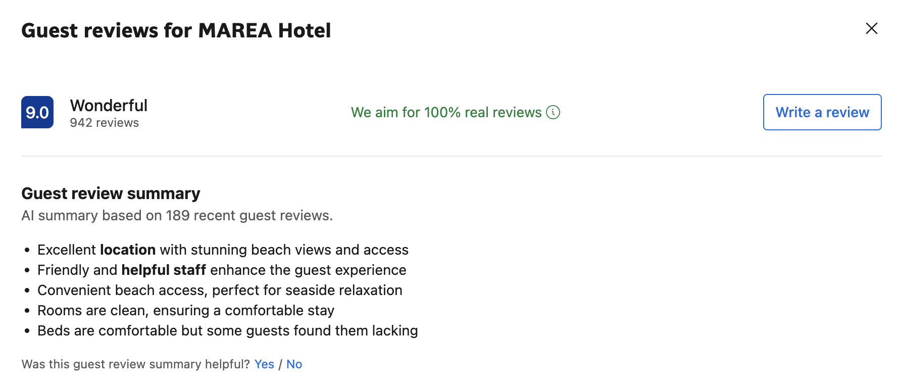

```{r setup, include=FALSE}
knitr::opts_chunk$set(echo = TRUE)
```

```{r, echo=FALSE, out.width="100%", out.height="25%"}

```

# Introduction

With thousands of restaurant reviews on platforms like Yelp, customers can easily feel overwhelmed. While star ratings offer a quick summary of overall quality, they often miss the nuances of what makes a dining experience good or bad — or what sets one restaurant apart from another.

This project uses text mining techniques to analyze Yelp restaurant reviews, identifying common themes, standout features, and sentiment patterns. The goal is to develop tools that help users navigate reviews more efficiently and make better-informed dining decisions.

The outputs from this project will answer the following questions:

-   **How do restaurants compare across standard aspects?**

    -   Use a custom aspect based sentiment analysis (ABSA) to highlight how restaurants perform across different categories. For example, if customers are on a budget, they can
        quickly identify if a restaurant has positive or negative
        reviews for *price*.

<!-- -->

-   **What makes each restaurant unique?**

    -   Use N-grams and TF-IDF to identify what makes each
        restaurant stand out, offering unique insights into
        menu items, deals, or service offerings that may be
        either appealing or off-putting to users. 

### Libraries

Install libraries, if needed.

```{r}
required_pkgs <- c("tidyverse",   
                   "tidytext",    
                   "quanteda",    
                   "textdata")    

new_pkgs <- required_pkgs[!required_pkgs %in% installed.packages()[,"Package"]]
if (length(new_pkgs)) install.packages(new_pkgs, dependencies = TRUE)
```

Load all necessary libraries for analysis.

```{r, message=FALSE}
library(tidyverse)   # text wrangling and dataviz: dplyr, readr, ggplot2, tibble, stringr
library(tidytext)    # tokenisation, stop-word removal, sentiment & TF-IDF helpers
library(quanteda)    # corpus objects, tokens(), kwic(), dfm() etc. 
library(textdata)    # sentiment lexicons like AFINN, BING, and NRC 
```

# Data cleaning and preprocessing

### Load dataset

```{r, message=FALSE}
sampled_reviews <- read_csv("yelp_sampled_reviews.csv")
```

### Tibble format

First, I confirm our data is already in tibble format, which is optimal
for most text mining techniques I plan to use.

```{r}
# check the class of our data, it is already a tibble
class(sampled_reviews)
```

### Tokenize

Next, I perform tokenization to break down each review into individual
words.

```{r}
# unnest tokens
reviews_tokenized <- sampled_reviews |> 
  unnest_tokens(word, review)
```

### Filter stopwords

I then remove common words that don't add analytical value, including
words specific to "Santa Barbara" since all reviews in the dataset are
from this city.

```{r}
# create custom location stopwords
location_stop_words <- tibble(
  word = c("santa", "barbara", "sb"),  
  lexicon = "custom"
)

# combine with standard stopwords
all_stopwords <- bind_rows(location_stop_words, stop_words)

# filter out all stopwords at once
reviews_final <- reviews_tokenized |> 
  anti_join(all_stopwords, by = "word") 
```

### View frequent words

Finally I identify the most common words across all reviews to get a
first look at what some of the themes in the customer feedback might be.
These words will also be useful to refer back to later when defining a
dictionary for our aspect-based sentiment analysis (ABSA).

```{r}
# view table of most frequent words
word_counts <- reviews_final |> 
  count(word, sort = TRUE)
word_counts
```

The most frequent words are standard restaurant terms such as food, service, menu, along with common adjectives customers use to describe their experiences, like nice, amazing, or fresh.

Now let's move on to identifying how these words group into broader themes and what they reveal about customers’ priorities and sentiments.

# ABSA tags – Sentiment analysis & KWIC

While overall sentiment scores and star ratings provide a high-level
overview of restaurants, they often mask the details that matter most to
customers. This is especially true for mid-range (3-star) reviews, where
customers often praise certain aspects while criticizing others. For
prospective customers, reading through dozens of reviews to find
information about specific aspects can be unnecessarily time-consuming.

This is where Aspect-Based Sentiment Analysis (ABSA) comes in. Rather
than analyzing sentiment at the whole-review level, ABSA can help explore sentiment toward specific dimensions of the dining experience.
This approach can help customers cut down on decision time by quickly
identify restaurants that excel in the categories they care about most
like service, food quality, or pricing.

#### Identifying key aspects

I first manually define four critical dimensions of the restaurant
experience that customers reference frequently, based on some of the
words included in the initial word count table (cleaning and preprocessing section).
The dimensions, or aspects, are:

1.  **Service** - Keywords related to staff interactions, wait times,
    and hospitality
2.  **Food** - References to dishes, ingredients, taste, and menu
    options
3.  **Price** - Mentions of cost, value, and pricing considerations
4.  **Environment** - Comments about the physical space, location, and
    seating arrangements

```{r}
# define aspect keywords
aspect_keywords <- list(
  service = c("manager", "waiter", "waitress", "wait", "staff", "server", "service", "host", "hostess", "minutes"),
  food = c("food", "meal", "dish", "menu", "taste", "flavor", "tacos", "burger", "sushi", "pasta", "pizza", "steak", "seafood"),
  price = c("cost", "value", "price", "pricing", "prices"),
  environment = c("parking", "location", "table", "tables", "seat", "seating", "inside", "outside", "outdoor")
)

# create aspect dictionary
aspect_dict <- tibble(
  aspect = rep(names(aspect_keywords), lengths(aspect_keywords)),
  keyword = unlist(aspect_keywords)
)

# create corpus with docvars
corp <- corpus(sampled_reviews$review, 
               docvars = sampled_reviews[, c("business", "review_id")])

# tokenize
toks <- tokens(corp, remove_punct = TRUE, remove_symbols = TRUE, remove_numbers = TRUE)
```

### Keywords in Context (KWIC) analysis

Next, I extract relevant keywords for each aspect along with their
surrounding context (3 words before and after since reviews are
relatively short), and assess the sentiment specifically associated with
that snippet. This approach allows us to identify which aspects a
restaurant performs well or poorly at (ex. great food but slow service),
so users can choose restaurants that align with their priorities.

```{r}
# extract key words in context (KWIC) for each keyword and combine results
kwic_all <- map_dfr(
  aspect_dict$keyword,
  ~ as_tibble(kwic(toks, pattern = .x, window = 3)) |> mutate(keyword = .x) #only used window = 3 since reviews are short form text
) |>
  left_join(aspect_dict, by = "keyword") |>
  mutate(
    context = paste(pre, keyword, post, sep = " "),
    row_id = as.integer(str_remove(docname, "^text"))
  ) |>
  left_join(
    docvars(corp) |> as_tibble() |> rowid_to_column("row_id"),
    by = "row_id"
  ) |>
  select(business, review_id, aspect, keyword, context)

# calculate sentiment scores of KWIC snippets 
context_sentiment <- kwic_all |> 
  unnest_tokens(word, context) |>
  inner_join(get_sentiments("bing"), by = "word") |>
  count(business, aspect, sentiment) |>
  pivot_wider(names_from = sentiment, values_from = n, values_fill = 0) |>
  mutate(net_sentiment = positive - negative)
context_sentiment
```

### Individual review check

Let's see how this code works at the review level to better
understand the aggregate data in the previous step. Each word from our dictionary is extracted with its context, and then
the snippet is tagged as either negative, positive, or neutral.

```{r}
# select a specific restaurant and review to inspect
specific_review <- kwic_all |>
  filter(business == "Santa Barbara Shellfish Company", review_id == "EfE7Ymq94m8eXXVXEqsKBQ") |>
  select(aspect, keyword, context)

# check words in each snippets
sentiment_words <- specific_review |>
  unnest_tokens(word, context) |>
  inner_join(get_sentiments("bing"), by = "word")

# add a column to show sentiment for each snippet
specific_review$sentiment <- sapply(1:nrow(specific_review), function(i) {
  words <- sentiment_words[sentiment_words$aspect == specific_review$aspect[i] & 
                          sentiment_words$keyword == specific_review$keyword[i], ]
  pos <- sum(words$sentiment == "positive")
  neg <- sum(words$sentiment == "negative")
  if(pos > neg) "positive" else if(neg > pos) "negative" else "neutral"
})
specific_review
```

### Example

These aspect-based sentiments, when aggregated, could be added as tags
to either individual reviews or restaurants pages as a whole to give
customers a quick snapshot of where a restaurant excels and where it
falls short. Here is an example at the restaurant level:

```{r}
# function to print a restaurant's aspect sentiment with colored tags
print_restaurant_sentiment <- function(restaurant_name, sentiment_data) {
  # filter data for the specified restaurant
  restaurant_aspects <- sentiment_data %>%
    filter(business == restaurant_name)
  
  if(nrow(restaurant_aspects) == 0) {
    return(knitr::asis_output(paste("Restaurant", restaurant_name, "not found in data.")))
  }
  
  # build output string
  output <- paste0("<h2>", restaurant_name, "</h2>\n")
  
  # sort aspects by net sentiment
  restaurant_aspects <- restaurant_aspects %>%
    arrange(desc(net_sentiment))
  
  # add HTML-formatted lines to output
  for(i in 1:nrow(restaurant_aspects)) {
    aspect <- restaurant_aspects$aspect[i]
    sentiment <- restaurant_aspects$net_sentiment[i]
    
    if(sentiment > 0) {
      # green for positive
      output <- paste0(output, "<span style='color: green;'>✓ ", aspect, " (", sentiment, ")</span><br>\n")
    } else if(sentiment < 0) {
      # red for negative
      output <- paste0(output, "<span style='color: red;'>✗ ", aspect, " (", sentiment, ")</span><br>\n")
    } else {
      # yellow for neutral
      output <- paste0(output, "<span style='color: orange;'>○ ", aspect, " (", sentiment, ")</span><br>\n")
    }
  }
  
  # return as raw HTML content that will be rendered properly
  knitr::asis_output(output)
}

# example:
print_restaurant_sentiment("Angel Oak", context_sentiment)

```

Here is a similar example from
[Amazon](https://www.amazon.com/MiiCoffee-Apex-Espresso-Machine-Stainless/dp/B0CLFN53LL/ref=sr_1_116_sspa?crid=223VLIIU5OEFY&dib=eyJ2IjoiMSJ9.E_8q9HE8-3miWbI2cm3UuuZs-ge3i16XOgpSt--w4qmKz8bTRqLPD1KjkAVvehhpNX9MJQqeZbxrfNxzY4UwyytLEq-GYK2tStzw2eaNxwjU4wWYlfoCt-TmjR9TBTuwaiYSY_MkbGluHx7sPnUNdpQvndUFaUwpvmUmYSILf-tK-lYBSKpvHgHHtKExpyvUcWJFaNonJoU5KMGriWEp_ua-UkeTIfCEKIyehyuMl_DSJSlf6WHU-Dqk7jJUloUAP6xVAkZqxElgybwbXYctORPo5gtYnDT5TB2F8car35Y.PDUgFyBm0HC9X5P-BQ_pIo-JNmEvhPLfyM6ijJD6gis&dib_tag=se&keywords=espresso%2Bmachine&qid=1745595262&sprefix=espresso%2Bmachin%2Caps%2C201&sr=8-116-spons&xpid=i2w7sXR0SkXsS&sp_csd=d2lkZ2V0TmFtZT1zcF9tdGY&th=1)
to show what output like this could look like on a real webpage:

```{r, out.width="100%", out.height="100%"}

```

# "Unique" Highlights – N-grams & TF-IDF

In addition to understanding how restaurants perform across common
categories (or aspects), its also nice to know what makes each
restaurant stand out against its competitors. In this section, I
identify distinctive features of each restaurant by analyzing common
phrases (N-grams) in their reviews that have high uniqueness value
(TF-IDF) compared to other restaurants.

### N-grams

First, I combine the individual words from reviews_final back
into complete text for each restaurant, creating one long string per
restaurant that contains all review words.

```{r}
# glue words back together by business to build n-grams
restaurant_text <- reviews_final |> 
  group_by(business) |> 
  summarise(text = str_c(word, collapse = " "), .groups = "drop")
```

Next, I create bigrams (two-word phrases) and trigrams (three-word
phrases) from each restaurants' combined reviews, and keep any N-gram
that occurs more than once per restaurant.

```{r}
# create bigrams for each restaurant
bigrams <- restaurant_text |> 
  unnest_tokens(ngram, text, token = "ngrams", n = 2)

# create trigrams for each restaurant
trigrams <- restaurant_text |> 
  unnest_tokens(ngram, text, token = "ngrams", n = 3)

# bind rows, and keep n-grams that appear ≥ 2× in a restaurant
ngrams_trim <- bind_rows(bigrams, trigrams) |> 
  count(business, ngram, sort = TRUE) |> 
  filter(n >= 2)
```

### TF-IDF

Now I can apply TF-IDF to the N-grams created in the last step.
This technique will help identify phrases that are both common within
a specific restaurant's reviews and uncommon across other restaurants,
effectively highlighting what makes each restaurant truly unique
compared to its competitors.

```{r}
tfidf <- ngrams_trim |>
  bind_tf_idf(term = ngram, document = business, n = n) |>
  group_by(business) |>
  slice_max(order_by = tf_idf, n = 3) |>  # n = # of n-grams per restaurant, can be adjusted
  ungroup()
tfidf
```

Now I have an initial list of N-grams, but some of these
N-grams are not useful in practice. For example the N-grams related to the
restaurant "Angel Oak": 1. contain the name of the restaurant as an
N-gram, which doesn't give us any valuable information and, 2. have some
overlap (ex. "french onion", "onion soup", and "french onion soup").
I manually define some rules to ensure the N-grams are **distinct and useful** for each restaurant.

Rules for N-gram ranking:

1.  Each of the top N-grams for a restaurant should contain unique
    keywords
2.  If multiple N-grams contain the same word (like "chicken"), keep
    only the highest-ranking one
3.  Exception: If there's a choice between a bigram and a trigram with
    the same word, prefer the trigram (more descriptive)
4.  N-grams should not mention the restaurant name

```{r}
highlights_distinct <- tfidf |> 
  # get top candidates first to reduce computation
  group_by(business) |> 
  slice_max(tf_idf, n = 30) |> 
  # process each row individually
  rowwise() |> 
  # filter out restaurant name mentions
  mutate(
    business_words = list(str_split(tolower(business), "\\s+")[[1]]),
    ngram_words = list(str_split(tolower(ngram), "\\s+")[[1]]),
    contains_business_word = length(intersect(unlist(business_words), unlist(ngram_words))) > 0,
    word_count = length(unlist(ngram_words))
  ) |> 
  filter(!contains_business_word) |> 
  # sort by word count and tf_idf
  group_by(business) |> 
  arrange(business, desc(word_count), desc(tf_idf)) |> 
  # apply word uniqueness rule
  group_modify(~{
    df <- .x |>  as.data.frame()
    result <- data.frame()
    used_words <- character(0)
    
    for(i in 1:nrow(df)) {
      current_words <- unlist(df$ngram_words[i])
      if(length(intersect(current_words, used_words)) == 0) {
        result <- rbind(result, df[i,])
        used_words <- c(used_words, current_words)
        if(nrow(result) >= 3) break
      }
    }
    
    result
  }) |> 
  # final selection
  select(business, ngram) |> 
  ungroup()
highlights_distinct
```

These results are much better! The N-grams show that many
restaurants are known for either their specific dishes like "pork belly
chops" or special service offerings like "happy hour" or "taco Tuesday."
These insights may appeal to customers looking for unique meals or
experiences, and can help customers quickly differentiate between
special offerings at each restaurant.

### Example

Some short highlights like these could be placed at the top of each
restaurant's review section to give customers an overview of the
restaurant's specialties. Within 5 seconds, a customer could decide
whether these standout features appeal to them or not. For example:

```{r}
# function to create highlight bullets
restaurant_highlights <- function(restaurant_name) {
  # get highlights for this restaurant
  highlights <- highlights_distinct %>% 
    filter(business == restaurant_name) %>%
    pull(ngram)
  # format with bullets
  result <- paste0(restaurant_name, " is known for its:\n")
  # add each highlight as a bullet point with proper spacing
  for (highlight in highlights) {
    result <- paste0(result, "• ", highlight, "\n")
  }
  # return the formatted string
  return(result)
}

# examples (insert any restaurant name here)
cat(restaurant_highlights("Baja Sharkeez"))
cat(restaurant_highlights("REBAR COFFEE + KTCHN"))
```

Here is a similar example from
[Booking.com](https://www.booking.com/hotel/es/marea-aparthotel.html?label=sitges-Qp7Ct2A*RWYXOf0qvrM3_gS392743200122%3Apl%3Ata%3Ap1360%3Ap2%3Aac%3Aap%3Aneg%3Afi%3Atikwd-5151333981%3Alp9199046%3Ali%3Adec%3Adm%3Appccp%3DUmFuZG9tSVYkc2RlIyh9Yf5EcukO1MOGLSSAuId8ToA&aid=303948&ucfs=1&checkin=2024-07-04&checkout=2024-07-05&dest_id=-403043&dest_type=city&group_adults=2&no_rooms=1&group_children=0&nflt=ht_beach%3D1%3Broomfacility%3D11&matching_block_id=40849320_120772463_0_0_0&atlas_src=sr_iw_title#tab-main)
to show what this type of output might look like on a real webpage:

```{r, out.width="100%", out.height="100%"}

```

# Conclusion

By going beyond star ratings and applying text mining techniques to Yelp reviews, this project aims to surface the specific strengths, weaknesses, and unique qualities of each restaurant. The resulting tools will make it easier for users to cut through the noise, compare options based on what matters to them, and make more confident dining choices.